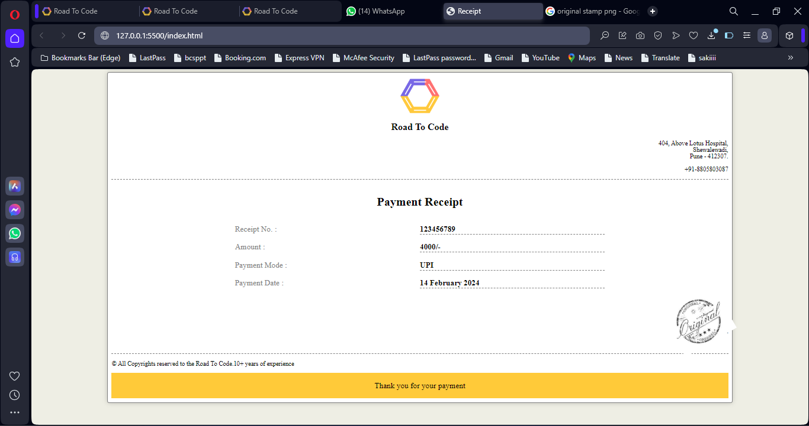

# Receipt repository
In this reposotory , I create one receipt of RTC . And There is logo of Road To Code in our receipt.
# Signature
For signature I have to download stamp from the google and tilt it by rotate and then set it as the sir tell us.
# Learning
I learn the basic things that , how to minimize the line of code and also learn to make the receipt.
# Receipt
This is sample receipt of RTC.

